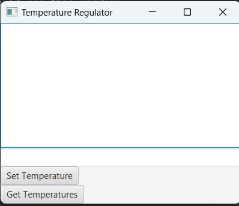
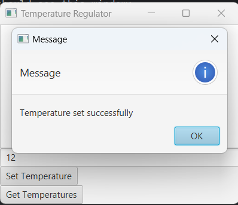
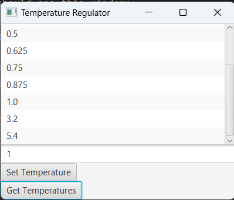
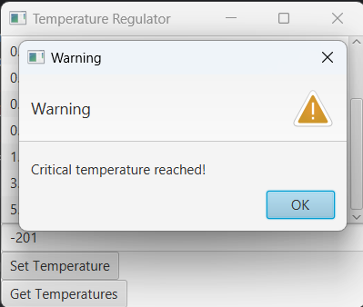
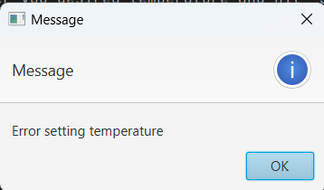

## To run application:
* Start server
* Start client

You should see this window:

1. Enter you desired temperature and hit "Set Temperature" button

2. You will see:

    
3. Hit "Get Temperature" button you will see:
    
    
4. If you enter temperature greater then 2000 and less then -200 you see:
    
    
    